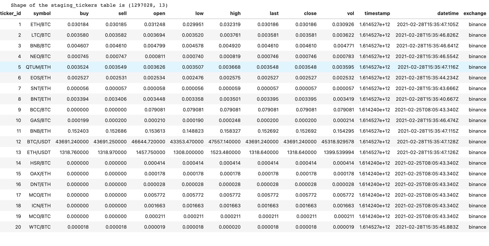
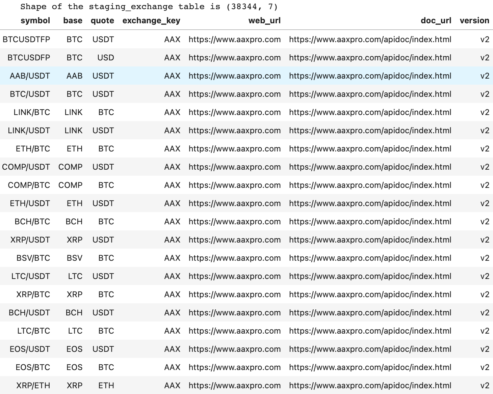
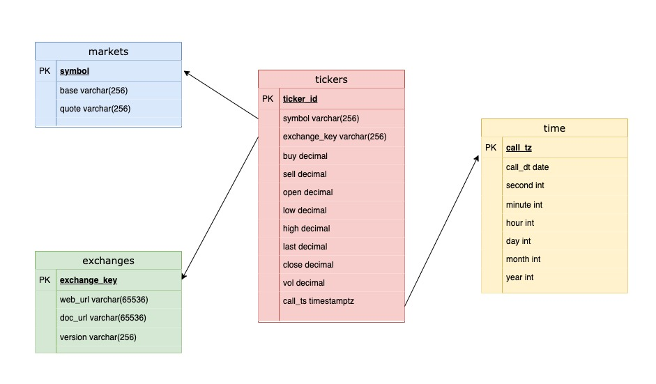
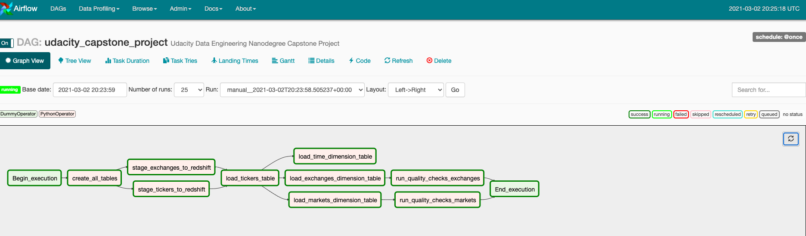
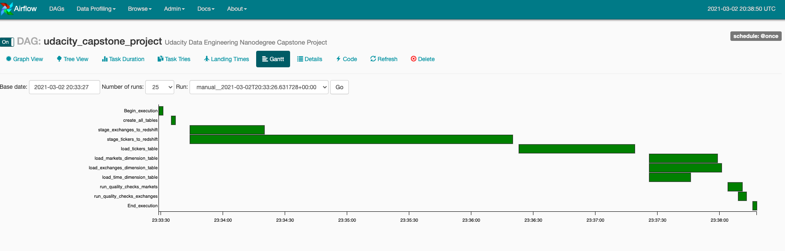
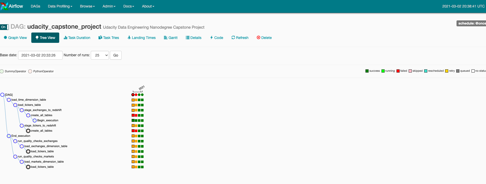
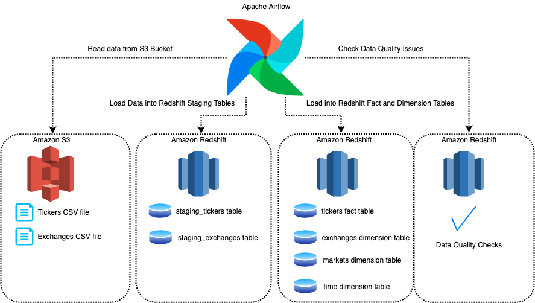

### 1-Scope of the Project

The objective of this project was to create a data pipeline for cryptocurrency exchange markets to showcase all the
learning & skills that been acquired during the course of the Data Engineering Nanodegree Program. To gather data, APIs
of the [ccxt](https://github.com/ccxt/ccxt/tree/master/wiki) package were consumed to get all the markets, exchanges,
and tickers. To sum up, 124 different exchanges and traded markets through these exchanges are collected via
asynchronous methods. For gathering tickers, a number of 10 exchanges, and their traded markets were used for an hour.

This project creates a data pipeline using Apache Airflow to extract, transform and load the requested datasets into a
data warehouse in Amazon Redshift for the analytics team to perform their analysis.

### 2-About Data

All the data for this project was loaded into s3 prior to commencing the project.

In addition to the data pipeline under Airflow, steps for data collecting are provided under the data_gathering
directory. Significant Python scripts are listed below, there are some other scripts under the directory that could be
used to expand the project is also shared.

* main.py : Consumes tickers from the following exchanges *binance, bittrex, kucoin, aax, acx, aofex, bequant, bibox,
  bigone, binanceus* in a asynchronous way.
* get_merged_ticker.py : Merges ticker files to create staging_tickers as a csv file.
* get_exchanges : Collects data from 124 different exchanges.
* get_markets : Collects market data that were traded through the exchanges.
* make_staging_exchanges.py : Merges markets, and their belonging exchanges data to create staging_exchanges as a csv
  file.

__The tickers dataset:__ It contains 12397028 tickers from 10 exchanges. This dataset provides information about each
ticker like market, exchange, volume, closing value, and more. Tickers dataset is in csv format, and it has 13 columns.

Sample data is shown below:

__The exchanges dataset:__ It contains 38344 rows of data about traded markets and exchanges about their features like
base of the market, web page of the exchange, and the version of the exchange. Exchanges dataset is in csv format, and
it has 7 columns.

Sample data is shown below:

### 3-Data Exploration

There are some data quality issues in the original dataset as shown below.

* __Missing values:__ There were missing values in the vol column of the tickers dataset because of the bugs in the *
  aofex* API. They were handled using *open*, and *close* columns.
* __Duplicate Data:__ Duplicated data in the exchanges dataset were handled using distinct *symbol*, and *exchange_key*
  pairs.

### Definition of Data Model

After the data exploration phase, I defined the conceptual data model as shown below.

#### 4.1. Staging Tables

The collected datasets are in csv format. Two Amazon Redshift tables were created in order to store these datasets.
Tickers dataset is stored in staging_tickers table and exchanges dataset is stored in staging_exchanges table. Then I
created ETL processes to read and load original datasets into these Redshift tables.

#### 4.2. Fact and Dimension Tables

Four Redshift tables were created to store fact and dimension tables. These are tickers, exchanges, markets, and time
tables.

Tickers: This is the fact table in the data model. It stores basic info about traded markets in various exchanges and
also foreign keys from other dimension tables. Exchanges: This dimension table is for exchange data. Markets: Markets
dimension table was created to store data about markets. Time: This is the time dimension table for storing the API call
date of the tickers. The information about time has a crucial effect on trading, therefore the time table contains a
column named *second* to get the value of the market in specific exchanges.

The whole conceptual data model is shown below.

### 5-ETL Process

The ETL pipeline in order to feed the tables which are defined in the data model is created. For this purpose, I created
a well-designed ETL pipeline in Apache Airflow. The Airflow DAG Graph is shown.

#### 5.1. ETL Steps

* __create_all_tables:__ Creates the tables in Redshift.
* __stage_exchanges_to_redshift:__ Reads exchange data from s3 and loads into Redshift staging table.
* __stage_tickers_to_redshift:__ Reads ticker data from s3 and loads into Redshift staging table.
* __load_tickers_table:__ Loads tickers fact table.
* __load_time_dimension_table:__ Loads time dimension table.
* __load_exchanges_dimension_table:__ Loads exchanges dimension table.
* __load_markets_dimension_table:__ Loads markets dimension table.

As a consequence of the size of the ticker dataset, reading from S3, and loading it into the Redshift cluster was
considerably time-consuming than other steps. Examine the Airflow DAG Gantt to more understanding.

DAG Tree for all the runs is also shown below.

### 6-About the Project

Three powerful technologies were used to reach the project goal which is a well-conceived ETL pipeline. Apache Airflow,
Amazon Redshift, and S3 took place as an ETL scheduler, a relational database, and file storage respectively. Running on
cloud and scaling abilities are the key aspects of why Amazon Redshift and S3 were chosen.

1. ETL starts with reading datasets from Amazon S3 bucket. Both tickers and exchanges datasets are in csv format.
2. Next step is loading these datasets into Redshift staging tables.
3. After staging tables are ready, it is time to load data into Redshift fact and dimension tables.
4. Finally, there are two data quality controls for tables in Redshift.

#### 6.1. airflow Directory

* __create_all_tables.sql:__ SQL queries for creating staging, fact and dimension tables
* __udacity_capstone_project_dag.py:__ main dag file
* __sql_queries.py:__ sql queries for inserting data into tables
* __data_quality.py:__ check data quality operator file
* __load_dimension.py:__ load dimension tables operator file
* __load_fact.py:__ load fact table operator file
* __stage_redshift.py:__ load staging tables operator file

### 7-Scenarios

* __If the data was increased by 100x :__

  * Apache Spark can be used to processing data. Because Spark is a fast and general engine for large-scale data
    processing.
  * Redshift is a distributed database so adding nodes will increase the writing and reading speed. Also, distributed
    keys can be added to the tables.
* __If the pipelines were run on a daily basis by 7am :__

  * Data is kept up-to-date.
  * Warning features can be added to dag in case of a possible error.
  * If data is increased, DAG's run-time can increase, the contrary loading speed can decrease. In this situation, my
    recommendation is to run pipelines on at least an hourly basis.

* __If the database needed to be accessed by 100+ people :__

  * With Amazon Redshift, it can be accessed by this number of people without living any performance issues.
  * If resources still are not enough, nodes can be added to the Redshift cluster.